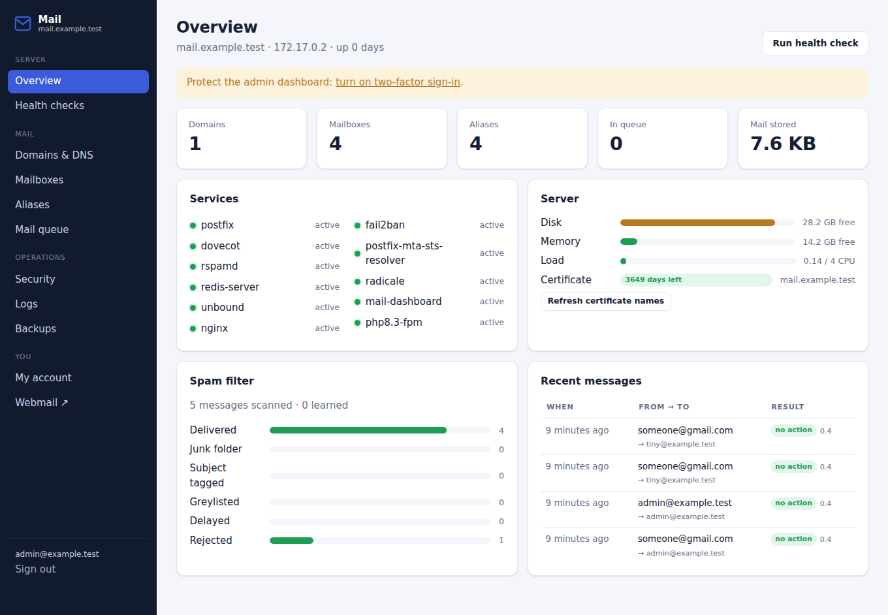
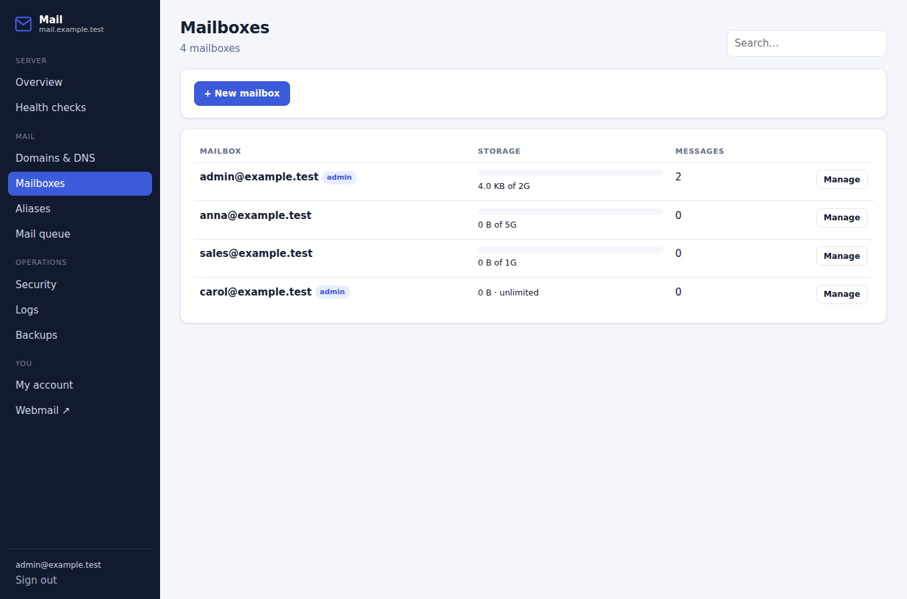
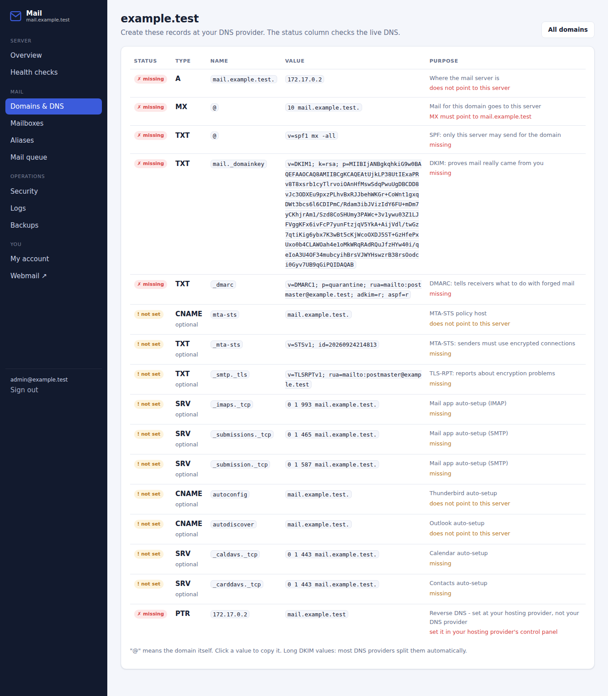
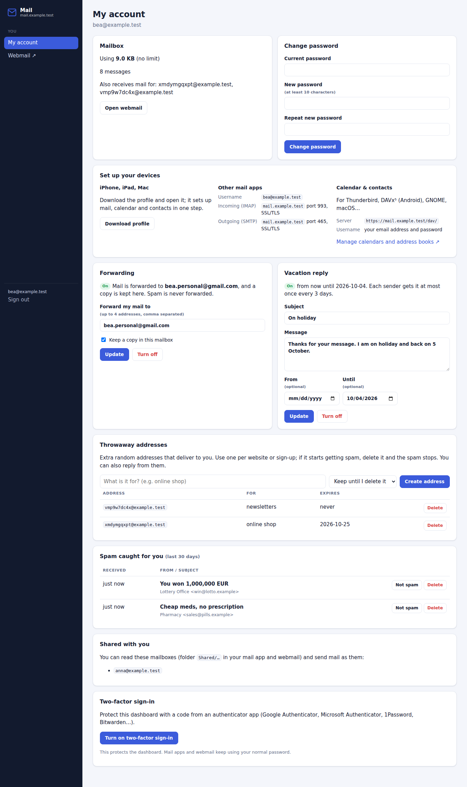
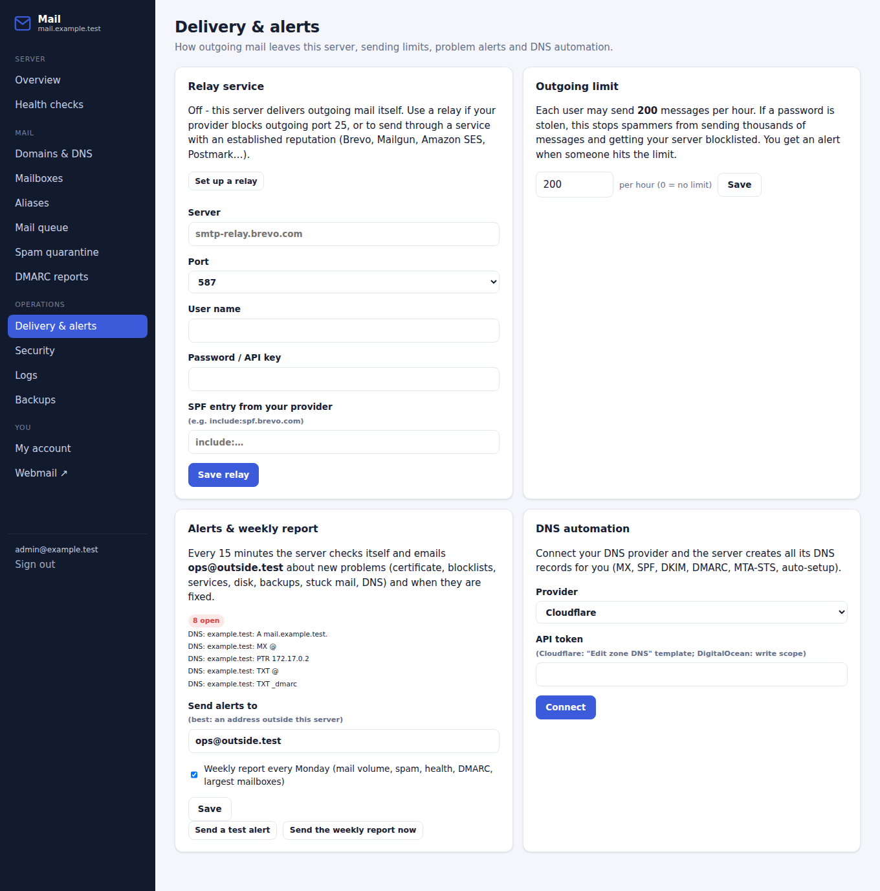
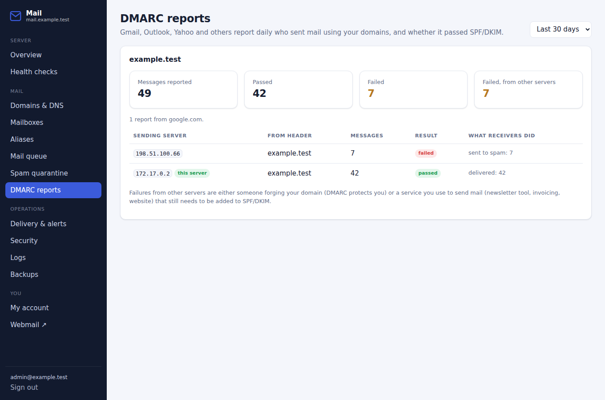
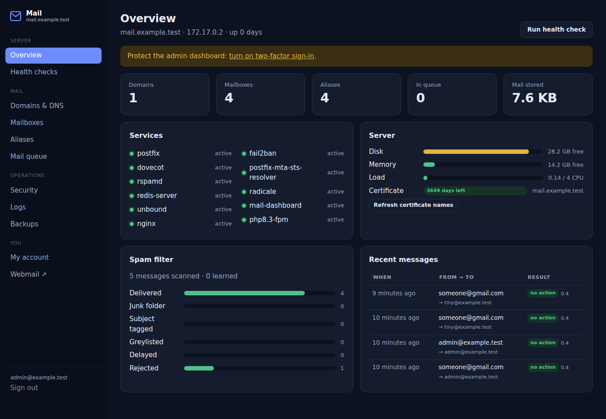

# mail-server

A complete email server for **Ubuntu Server 24.04 LTS and 26.04 LTS**, installed
directly on the machine with one script. No Docker.

It includes a web **admin dashboard** with two-factor sign-in, **calendars and
contacts**, **shared mailboxes**, **mailbox quotas**, **MTA-STS**, live **DNS
and health checks**, **email alerts**, **DMARC reports**, a **spam
quarantine**, **automatic DNS records** (Cloudflare, DigitalOcean), an optional
**relay service** for outgoing mail, and a self-service page where every user
can set forwarding, vacation replies and throwaway addresses.



| Part | What it does |
| --- | --- |
| **Postfix** + postscreen | Receives mail from the internet (port 25) and sends mail for your users (ports 587 and 465). Bots are dropped before they reach the mail server |
| **Dovecot** | Stores mailboxes and serves them to mail apps over IMAP (port 993). Handles quotas, shared mailboxes, full-text search and server-side filters (Sieve) |
| **Rspamd** + Redis | Spam filtering, greylisting, DKIM signing and ARC. Learns from what users move in or out of Junk |
| **ClamAV** | Virus scanning (optional) |
| **Unbound** | Local DNS resolver, so spam blocklists such as Spamhaus work |
| **Roundcube** | Webmail at `https://mail.yourdomain.com/`, with filters and vacation replies |
| **Admin dashboard** | `https://mail.yourdomain.com/admin/`: domains, mailboxes, aliases, shared mailboxes, quotas, DNS checks and automation, health checks, mail queue, spam quarantine, DMARC reports, relay, sending limits, alerts, blocked IPs, logs, backups, 2FA |
| **Radicale** | Calendars and contacts (CalDAV/CardDAV) at `/dav/`, using the email password |
| **MTA-STS** + TLS-RPT | Tells Gmail, Outlook and others to only send to you encrypted, and to report problems. Outgoing mail also honours other domains' MTA-STS |
| **Let's Encrypt** | Free TLS certificates, renewed automatically |
| **Fail2ban** + UFW | Blocks password-guessing (mail, webmail, dashboard, calendars) and closes every unused port |
| **mailctl** | One command to manage everything from the terminal, with JSON output |

Also included:
- **Alerts and reports:** emails about problems as they happen, and a weekly report.
- **Protection against stolen passwords:** a limit on how many messages each user can send per hour.
- **Backups:** nightly, optionally copied off-site.
- **Security updates:** installed automatically.
- **Automatic setup** for Thunderbird, Outlook, iPhone and Mac.
- **Multiple domains** on one server.
- **An audit log** of every admin change.

---

## How it compares

A summary of what the well-known self-hosted mail servers offer out of the box:

| | **this project** | mailcow | Mail-in-a-Box | Mailu | iRedMail (free) |
| --- | :---: | :---: | :---: | :---: | :---: |
| Runs without Docker | ✅ | ❌ | ✅ | ❌ | ✅ |
| Ubuntu 26.04 LTS | ✅ | ✅ (Docker) | ❌ | ✅ (Docker) | ✅ |
| Web admin dashboard | ✅ | ✅ | ✅ | ✅ | ✅ |
| Two-factor sign-in (TOTP) for admins | ✅ | ✅ | ✅ | ✅ | ❌ |
| Self-service page for users | ✅ | ✅ | ❌ | ✅ | ❌ |
| Live DNS record checks | ✅ | ✅ | ✅ | ❌ | ❌ |
| Server health checks (blocklists, ports, certs) | ✅ | partly | ✅ | ❌ | ❌ |
| Mailbox quotas (refused at SMTP time) | ✅ | ✅ | ❌ | ✅ | ✅ |
| Spam filter that learns from Junk | ✅ | ✅ | ✅ | ✅ | ✅ |
| DKIM, SPF, DMARC, ARC | ✅ | ✅ | ✅ | ✅ | ✅ |
| MTA-STS for incoming mail | ✅ | ✅ | ✅ | ❌ | ❌ |
| MTA-STS for outgoing mail | ✅ | ✅ | ❌ | ❌ | ❌ |
| Calendars and contacts | ✅ Radicale | ✅ SOGo | ✅ Nextcloud | ✅ | ❌ |
| iPhone/Mac setup profile | ✅ | ✅ | ✅ | ❌ | ❌ |
| Outlook and Thunderbird auto-setup | ✅ | ✅ | ✅ | ✅ | ❌ |
| Mail queue management in the web UI | ✅ | ✅ | ❌ | ❌ | ❌ |
| Spam quarantine in the web UI | ✅ | ✅ | ❌ | ❌ | ❌ |
| Users set forwarding and vacation replies | ✅ | ✅ | via webmail | ✅ | via webmail |
| Shared mailboxes (team inboxes) | ✅ | ✅ | ❌ | ❌ | paid version |
| Throwaway addresses | ✅ | ✅ | ❌ | ❌ | ❌ |
| Full-text search of mailboxes | ✅ | ✅ | ❌ | ✅ | ❌ |
| Relay service for outgoing mail | ✅ web UI | ✅ web UI | manual | config file | manual |
| Per-user sending limit | ✅ | ✅ | ❌ | ✅ | ❌ |
| Alert emails when something breaks | ✅ + weekly report | ✅ | ✅ daily status | ❌ | ❌ |
| DMARC report viewer | ✅ | ❌ | ❌ | ❌ | ❌ |
| Creates DNS records automatically | ✅ Cloudflare, DigitalOcean | ❌ | ✅ runs its own DNS | ❌ | ❌ |
| Unblock banned IPs from the web UI | ✅ | ✅ | ❌ | ❌ | ❌ |
| Audit log of admin changes | ✅ | ✅ | ❌ | ❌ | ❌ |
| Off-site backup copies | ✅ rsync | ✅ | ✅ S3/rsync | ❌ | ❌ |
| Minimum RAM | ~1.5 GB (3 GB with ClamAV) | 6 GB | 1 GB | 2 GB | 2 GB |

The goal was mailcow-level features on a plain Ubuntu server, using only
Ubuntu's own packages so security updates arrive automatically. The table is
based on each project's public feature lists at the time of writing.

---

## Before you start

You need:

1. **A server running a fresh Ubuntu Server 24.04 or 26.04**, with at least
   2 GB RAM (4 GB if you want virus scanning) and a static public IP address.
2. **Port 25 open, both in and out.** Many cloud providers block it by default.
   Ask your provider to unblock it.
3. **A domain you control**, for example `example.com`.
4. **Access to reverse DNS (PTR)** for the server's IP. You usually set this in
   your hosting provider's control panel.

## Installation

### 1. Create the first DNS records

At your DNS provider, create these two records and wait a few minutes:

| Type | Name | Value |
| --- | --- | --- |
| A | `mail.example.com` | your server's IPv4 address |
| MX | `example.com` | `10 mail.example.com` |

At your **hosting provider**, set the reverse DNS (PTR) for the server's IP to
`mail.example.com`.

### 2. Get the files onto the server

```bash
ssh root@YOUR.SERVER.IP
apt update && apt install -y git
git clone https://github.com/npetronikolos/mail-server.git
cd mail-server
```

### 3. Fill in the settings

```bash
cp mail-server.conf.example mail-server.conf
nano mail-server.conf
```

At minimum, set `DOMAIN`, `MAIL_HOSTNAME`, `SERVER_IPV4`, `ADMIN_EMAIL` and
`LETSENCRYPT_EMAIL`. Every setting is explained in the file. The main ones:

| Setting | Default | What it does |
| --- | --- | --- |
| `ENABLE_DASHBOARD` | `yes` | Admin dashboard at `/admin/` |
| `ADMIN_ALLOWED_IPS` | *(anywhere)* | Only allow the dashboard from these IPs or networks |
| `ENABLE_DAV` | `yes` | Calendars and contacts at `/dav/` |
| `ENABLE_MTA_STS` / `MTA_STS_MODE` | `yes` / `enforce` | MTA-STS policy for your domains |
| `DEFAULT_QUOTA` | *(unlimited)* | Storage limit for new mailboxes, e.g. `5G` |
| `ENABLE_CLAMAV` | `yes` | Virus scanning (needs about 1.5 GB RAM) |
| `ENABLE_WEBMAIL` | `yes` | Roundcube webmail |
| `BACKUP_RSYNC_TARGET` | *(none)* | Copy every backup to another machine over SSH |
| `RELAY_HOST` (+ `RELAY_PORT`, `RELAY_USER`, `RELAY_PASSWORD`, `RELAY_SPF`) | *(none)* | Send outgoing mail through a relay service |
| `OUTGOING_LIMIT_PER_HOUR` | `200` | Messages each user may send per hour |
| `ALERT_EMAIL` / `WEEKLY_REPORT` | `LETSENCRYPT_EMAIL` / `yes` | Where problem alerts and the weekly report go |
| `DNS_PROVIDER` / `DNS_API_TOKEN` | *(none)* | Create DNS records automatically (`cloudflare` or `digitalocean`) |

The relay, limit, alert and DNS settings are applied at the first install;
after that, change them on the dashboard's **Delivery & alerts** page (or
with `mailctl`).

### 4. Run the installer

```bash
sudo ./install.sh
```

It takes about 5 to 10 minutes. At the end it prints your webmail and
dashboard addresses, mail app settings, and **the full list of DNS records to
create**. You can run `install.sh` again at any time, for example after
changing `mail-server.conf`. It keeps your mailboxes, aliases, passwords and
keys.

### 5. Create the remaining DNS records

**Automatically:** if you set `DNS_PROVIDER` and `DNS_API_TOKEN`, the installer
already created them. You can also connect Cloudflare or DigitalOcean later on
the dashboard's **Delivery & alerts** page. Then use **Create records at …** on
a domain's page: it shows every change and makes them only after you confirm.

**By hand:** open the dashboard, go to **Domains & DNS**, and pick your domain.
Each record has a click-to-copy value and a live status column showing whether
it's correct yet. From the terminal: `sudo mailctl dns --check`.
See **[DNS.md](DNS.md)** for what each record does.

### 6. Secure the dashboard and test

1. Sign in at `https://mail.example.com/admin/` with `ADMIN_EMAIL` and its
   password. Open **My account**, then **Turn on two-factor sign-in**.
2. Open **Health checks**. Everything should be green except DNS records you
   haven't created yet.
3. Work through the [test checklist](#test-checklist).

---

## The admin dashboard

`https://mail.example.com/admin/`: sign in with an admin mailbox's email and
password.

| Page | What you can do |
| --- | --- |
| **Overview** | Service status, disk/memory/load, certificate expiry, spam filter statistics, recent messages |
| **Health checks** | Services, ports, outgoing port 25, Spamhaus listing, certificate, backups and every DNS record, each with a fix hint |
| **Domains & DNS** | Add and remove domains. Each domain's DNS records with live status and click-to-copy values |
| **Mailboxes** | Create (with a generated password if you like), change passwords, set quotas, share with other users, grant admin rights, reset 2FA, delete. Usage bars and search |
| **Aliases** | Forwarding addresses, to several recipients or outside addresses, and catch-alls |
| **Mail queue** | See why mail is stuck, retry, hold, release or delete |
| **Spam quarantine** | Everything the spam filter put in anyone's Junk folder. "Not spam" moves it to the inbox and trains the filter |
| **DMARC reports** | Who sends mail using your domains (from Gmail, Outlook and Yahoo's daily reports), what passed, and what looks like forgery |
| **Delivery & alerts** | Relay service (set up and test), per-user sending limit, alert address and weekly report, DNS provider connection |
| **Security** | IPs blocked by Fail2ban (unblock with one click), dashboard sign-ins, audit log of every admin change |
| **Logs** | Mail, spam filter, security, web and audit logs, with search |
| **Backups** | List backups, run one now, off-site copy status |
| **My account** | Change password, turn on 2FA, iPhone/Mac profile, mail app and calendar settings |

<p>


</p>

**Users who aren't admins** can sign in too. They get only **My account**:
- **Forwarding:** forward their mail elsewhere, keeping a copy or not. Spam is never forwarded.
- **Vacation reply:** an auto-reply, optionally between two dates.
- **Throwaway addresses:** random addresses for sign-ups, with an optional expiry date.
- **Their own spam:** see what the filter caught, and rescue what isn't spam.
- **Mailboxes shared with them.**
- **Account basics:** storage usage, password change, two-factor sign-in, a one-tap iPhone/Mac setup profile, and settings for any other mail or calendar app.



<p>


</p>

**How it's secured:**

- It runs as its own unprivileged user. The only privileged thing it can do
  is run `mailctl` (a single sudo rule), which validates everything and
  records who changed what.
- Passwords are checked against the mail server itself. There's no separate
  admin password to leak.
- Two-factor sign-in (TOTP), with replay protection.
- Protection against request forgery on every form, a strict Content Security
  Policy (no external scripts or styles), secure session cookies, and
  sign-out after 30 idle minutes.
- Rate limiting, plus a Fail2ban jail that blocks IPs guessing passwords.
- Optional IP allow-list (`ADMIN_ALLOWED_IPS`).

It follows your system's light or dark mode and works on phones.



---

## Everyday management from the terminal: `mailctl`

Everything the dashboard does is also available with `sudo mailctl`. Add
`--json` to any command for machine-readable output.

```bash
# Mailboxes
mailctl user add anna@example.com [--quota 5G]   # asks for a password
mailctl user passwd anna@example.com
mailctl user quota anna@example.com 10G           # or "none"
mailctl user list                                 # usage, quota, message count
mailctl user del anna@example.com [--purge]       # --purge also deletes mail, calendars, contacts

# Aliases and forwarding
mailctl alias add info@example.com anna@example.com,bob@gmail.com
mailctl alias add @example.com anna@example.com   # catch-all
mailctl alias list | del <alias>

# Domains
mailctl domain add example.org                    # creates DKIM key, prints DNS records
mailctl domain list | del <domain>

# Health
mailctl status                                    # services, certificate, counts
mailctl check                                     # full health check
mailctl dns [domain] [--check]                    # records to create / verify them live

# Operations
mailctl queue [list|flush]                        # outgoing mail queue
mailctl queue delete|hold|release <id|ALL>
mailctl bans                                      # IPs blocked by Fail2ban
mailctl unban 1.2.3.4
mailctl logs [mail|postfix|dovecot|spam|security|web|audit] [--grep TEXT] [--lines N]
mailctl backup [--background] | backup list
mailctl cert                                      # add mta-sts/autoconfig/autodiscover names to the certificate

# Users' own settings
mailctl user forward anna@example.com --to me@gmail.com [--no-keep] | --off
echo "Back Monday." | mailctl user vacation anna@example.com --subject "Away" --end 2026-10-10
mailctl user vacation anna@example.com --off
mailctl alias temp add anna@example.com --days 30 --note "online shop"   # throwaway address
mailctl alias temp list | temp del <address>

# Shared mailboxes
mailctl share add info@example.com anna@example.com   # anna can read info@ and send as it
mailctl share del info@example.com anna@example.com
mailctl share list

# Spam quarantine and search
mailctl junk [--user anna@example.com] [--days 7]
mailctl junk release|delete <mailbox> <id>
mailctl search rebuild [email]

# Delivery, limits, alerts
echo "API-KEY" | mailctl relay set smtp-relay.brevo.com --port 587 --user me@x.com --spf include:spf.brevo.com
mailctl relay [status] | relay test | relay off
mailctl limit set 200                              # messages per user per hour (0 = no limit)
mailctl alerts config --email me@gmail.com --weekly yes
mailctl alerts [status] | alerts run | alerts test
mailctl report --force                             # weekly report now
mailctl dmarc [--days 30]

# DNS automation
echo "API-TOKEN" | mailctl dns provider set cloudflare     # or digitalocean
mailctl dns apply example.com                      # preview
mailctl dns apply example.com --yes                # make the changes

# Dashboard access
mailctl admin add|del <email>
mailctl admin list
```

Notes:

- Passwords must be at least 10 characters. Changes take effect immediately:
  `mailctl` only returns once the mail server is using them.
- A user can send email **as their own address and as any alias that
  delivers to them**. Any other From: address is refused. The owner of a
  catch-all can send as any address in that domain.
- `postmaster@` and `abuse@` are created for every domain and go to the admin.
- Mail for a mailbox that is over its quota is refused while the sending
  server is still connected, so it doesn't bounce later. On Ubuntu 26.04
  (Dovecot 2.4), a mailbox may go up to 10 MB over its limit so that the last
  message still fits.

## Shared mailboxes

A shared mailbox is a normal mailbox, like `info@` or `support@`, that other
users can also read. Create it on the **Mailboxes** page, then use
**Manage → Share with** for each team member.

- Members see it as a folder, `Shared/info@example.com`, in their mail apps
  and in webmail. They don't need its password.
- Read and unread status is tracked separately for each person.
- Members can send mail as the shared address.
- New folders in a shared mailbox are shared automatically each night.

## Sending through a relay service

If your hosting provider blocks outgoing port 25, or you want to send through
a service with an established reputation, use a relay. Examples: Brevo,
Mailgun, Amazon SES, Postmark, SMTP2GO.

Set it up on **Delivery & alerts → Relay service**, or with `RELAY_*` in
`mail-server.conf`, then use **Test connection**. Add the relay's SPF entry
(e.g. `include:spf.brevo.com`) so that `mailctl dns` and the Domains page show
the right SPF record.

Incoming mail still arrives directly on port 25. DKIM signing stays on this
server, so DMARC keeps passing.

## Alerts, sending limit and weekly report

- **Alerts.** Every 15 minutes the server runs its health check. It emails
  `ALERT_EMAIL` (or `LETSENCRYPT_EMAIL`) when a new problem appears and again
  when it's fixed. Covered: services, certificate expiry, Spamhaus listing,
  outgoing connectivity, disk, backups, the mail queue and DNS. A problem
  that stays unresolved is repeated once a day.
- **Sending limit.** Each user may send `OUTGOING_LIMIT_PER_HOUR` messages per
  hour (200 by default). When someone hits it, their extra mail is delayed,
  not lost, and you get an alert. A sudden burst of mail usually means a
  password was stolen.
- **Weekly report.** Every Monday morning you get a summary: mail received and
  sent, spam caught, health, the largest mailboxes, DMARC results and the
  last backup.

## DMARC reports

Your `_dmarc` record asks big mail providers to send daily reports to
`dmarc-reports@<your domain>`. The server reads these automatically; there's
no mailbox to fill up. The **DMARC reports** page shows every server that sent
mail using your domain, and whether it passed.

- **Your own server** should always pass.
- **Failures from other servers** mean one of two things. Either someone is
  forging your domain, which DMARC then blocks. Or you use a service that
  sends mail as your domain (a newsletter tool, invoicing, your website)
  that you still need to add to SPF/DKIM.

## Mail app settings

| | Server | Port | Security |
| --- | --- | --- | --- |
| Incoming (IMAP) | `mail.example.com` | 993 | SSL/TLS |
| Outgoing (SMTP) | `mail.example.com` | 465 | SSL/TLS |
| Outgoing (alternative) | `mail.example.com` | 587 | STARTTLS |

The username is the **full email address**. Automatic setup:

- **Thunderbird and K-9/Thunderbird for Android:** type the email address and
  password, and it finds the rest.
- **Outlook:** uses the `autodiscover` record.
- **iPhone, iPad, Mac:** sign in to the dashboard, open **My account**, then
  **Download profile**. It sets up mail, calendar and contacts in one step.

## Calendars and contacts

Server: `https://mail.example.com/dav/`. Sign in with your email address and
password.

- **iPhone/Mac:** included in the dashboard profile (see above).
- **Android:** DAVx⁵, with "Login with URL and user name".
- **Thunderbird:** New Calendar, then On the Network, then the URL above.
- **Web:** `https://mail.example.com/dav/.web/` to create calendars and address books.

Everyone only sees their own calendars and contacts.

## Webmail

Open `https://mail.example.com/` and log in with your full email address (or
just the part before the @ for your main domain). Under **Settings → Filters**
you can create mail rules and vacation auto-replies. They run on the server,
so they also work when no app is open.

## Spam

- Everything caught is visible on the **Spam quarantine** page, and to each
  user on their account page. "Not spam" rescues a message and trains the
  filter.
- Mail with a score of 15 or more is **rejected**.
- Mail with a score of 6 or more is **delivered to Junk**.
- Mail with a score between 4 and 6 is **greylisted**: the sender is asked to
  retry a few minutes later. Real mail servers do; most spam bots don't.
- **postscreen** drops bots that talk before the server greets them.
- **Training:** moving a message into Junk teaches the filter "this is spam".
  Moving it out of Junk teaches "this is not spam". The *Mark as junk* button
  in Roundcube does the same.
- Junk is emptied automatically after 30 days.

The dashboard's Overview shows spam statistics and recent messages. The full
Rspamd interface is only reachable from the server itself, through an SSH tunnel:

```bash
ssh -L 11334:127.0.0.1:11334 root@mail.example.com
# then browse to http://localhost:11334
# password: sudo grep RSPAMD_WEB_PASSWORD /etc/mail-server/secrets
```

## Backups

A backup runs every night at 03:30 and is kept for 14 days. It contains all
mailboxes, calendars and contacts, configuration, DKIM keys, certificates, 2FA
secrets and webmail settings. Backups go to `/var/backups/mail-server/`. You
can also run one from the dashboard's **Backups** page.

**Keep a copy somewhere else.** Set `BACKUP_RSYNC_TARGET` (e.g.
`backup@nas.example.com:/backups/mail`) and every backup is copied there
automatically. First let root log in there with a key:

```bash
sudo ssh-keygen -t ed25519          # press Enter at each question
sudo ssh-copy-id backup@nas.example.com
```

Or copy them by hand from your own computer:

```bash
rsync -av root@mail.example.com:/var/backups/mail-server/ ./mail-backups/
```

### Restoring onto a new server

1. Install a fresh server with the same `mail-server.conf` and run `install.sh`.
2. Copy the backup over, then:

```bash
sudo systemctl stop postfix dovecot radicale mail-dashboard
sudo tar -xzf mail-backup-DATE.tar.gz -C /
sudo ./install.sh              # re-applies configuration and restarts everything
```

## Test checklist

- [ ] Dashboard → **Health checks**: no red items (DNS may take a while).
- [ ] Log in to webmail at `https://mail.example.com/`.
- [ ] Send a mail **from Gmail to your address**. It arrives in the inbox.
- [ ] **Reply from your address to Gmail.** It arrives in the Gmail inbox, not
      spam. In Gmail, open *⋮ → Show original*: SPF, DKIM and DMARC should
      all say `PASS`.
- [ ] Send a mail to the address shown on <https://www.mail-tester.com> and
      aim for 10/10.
- [ ] Check TLS and MTA-STS: <https://internet.nl/test-mail/>.
- [ ] Set up the account on your phone and send and receive a message.
- [ ] Turn on two-factor sign-in for the dashboard.

## Troubleshooting

| Problem | What to check |
| --- | --- |
| Installer says the DNS name doesn't resolve | The A record for `MAIL_HOSTNAME` is missing or hasn't propagated. Check with `dig +short mail.example.com`. |
| Let's Encrypt fails | Port 80 must be reachable from the internet, and the A record must point to this server. |
| Mail lands in Gmail/Outlook spam | Dashboard → Domains & DNS: every record green? PTR set? Test with mail-tester.com. A new IP needs a few days of normal sending to build a reputation. |
| Outgoing mail stays in the queue | Dashboard → Mail queue shows the reason. "Connection timed out" to port 25 means your provider blocks outgoing port 25. |
| A user can't log in | Dashboard → Security: is their IP blocked? Unblock it there. Or `sudo doveadm auth test user@example.com`. |
| Locked out of the dashboard (lost 2FA phone) | Another admin can use Mailboxes → Manage → Reset 2FA. Or on the server, edit `/var/lib/mail-dashboard/totp.json` and remove your line. |
| See what is happening | Dashboard → Logs, or `sudo journalctl -u postfix -u dovecot -f`. |

## Files and locations

| Path | Contents |
| --- | --- |
| `/etc/mail-server/mail-server.conf` | Your settings (copied in by the installer, without the admin password) |
| `/etc/mail-server/admins` | Mailboxes allowed to use the admin dashboard |
| `/etc/mail-server/secrets` | Generated passwords (Rspamd web UI, Roundcube key) |
| `/var/vmail/<domain>/<user>/Maildir` | The mail itself |
| `/var/lib/radicale/` | Calendars and contacts |
| `/var/lib/mail-dashboard/` | Dashboard session key and 2FA secrets |
| `/etc/dovecot/users` | Mailboxes, password hashes and quotas |
| `/etc/postfix/vdomains`, `vmailbox`, `virtual` | Domains, mailboxes, aliases (edit them with `mailctl` or the dashboard) |
| `/var/lib/rspamd/dkim/` | DKIM private keys |
| `/var/log/mailctl.log` | Audit log: every change, with who made it |
| `/var/log/mail-dashboard/auth.log` | Dashboard and calendar sign-ins |
| `/etc/mail-server/settings.json` | Relay, sending limit and alert settings (changed from the dashboard) |
| `/etc/mail-server/shares.json`, `temp-aliases.json` | Shared mailboxes and throwaway addresses |
| `/var/lib/mail-server/dmarc/` | Received DMARC reports |
| `/var/backups/mail-server/` | Nightly backups |

## Repository layout

```
install.sh                   the installer
mail-server.conf.example     settings template
bin/mailctl                  management command (Python; installed to /usr/local/sbin)
bin/mail-backup              backup script (runs nightly from cron)
bin/mail-dmarc-ingest        reads incoming DMARC reports (run by Postfix)
bin/mail-server-fix-packages
                             works around bugs in Ubuntu packages (Roundcube on PHP 8.5,
                             MTA-STS resolver on Python 3.14)
dashboard/                   the admin dashboard (Flask, served by gunicorn)
templates/                   configuration files for every service
DNS.md                       DNS records explained
docs/screenshots/            dashboard screenshots
```
